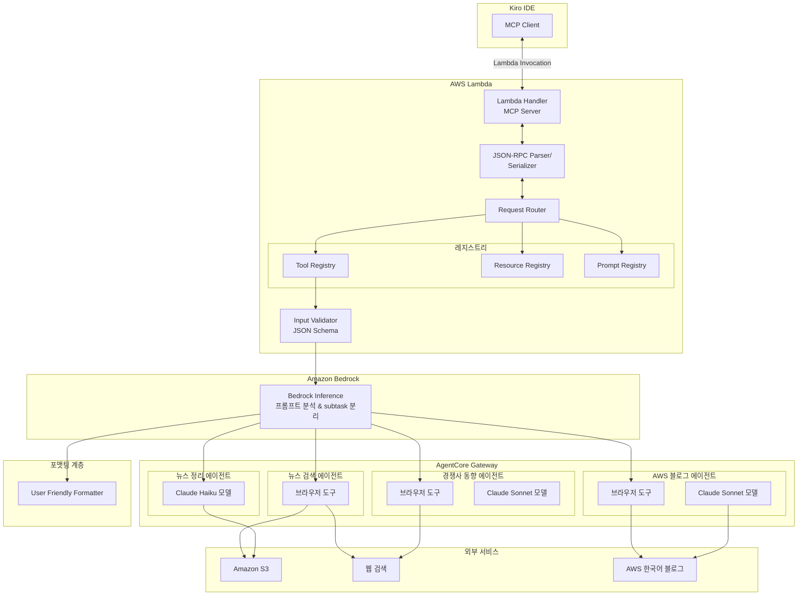
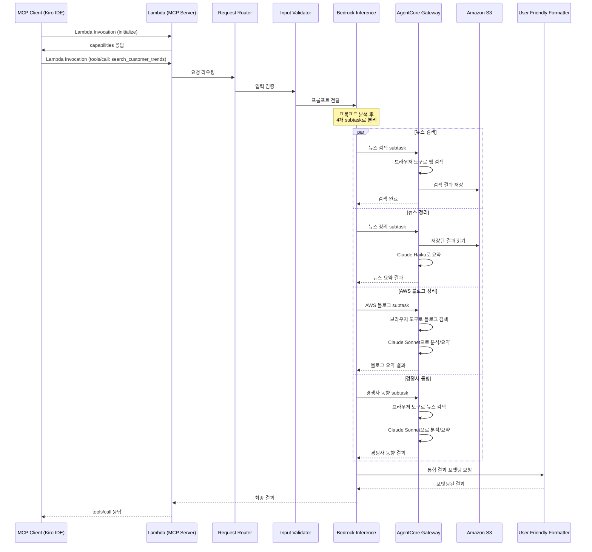

# 기술 설계 문서: MCP Application

## 개요 (Overview)

본 문서는 Kiro IDE에서 MCP(Model Context Protocol) 서버로 동작하는 애플리케이션의 기술 설계를 기술한다. 이 애플리케이션은 AWS Account Manager가 담당 고객사의 최신 뉴스, AWS 모범사례 블로그, 경쟁 솔루션 동향을 한 번의 Tool 호출로 통합 조회할 수 있도록 한다.

시스템은 크게 세 계층으로 구성된다:

1. **MCP 프로토콜 계층 (Lambda)**: Lambda function이 MCP 서버로 동작하며, Kiro IDE가 Lambda를 MCP 서버로 등록하여 호출한다
2. **AI 추론 계층 (Bedrock)**: Lambda가 수신한 프롬프트를 Bedrock inference에 전달하면, Bedrock이 subtask(뉴스검색, 뉴스정리, AWS 블로그정리, 경쟁사 동향)로 분리하고 AgentCore Gateway의 sub 도구들을 활용하여 각 작업을 수행한다
3. **포맷팅 계층**: User_Friendly_Formatter가 기술 용어를 비즈니스 관점 표현으로 변환하여 최종 결과를 생성한다

### 기술 스택

- **런타임**: AWS Lambda (Node.js / TypeScript)
- **MCP SDK**: `@modelcontextprotocol/sdk` (공식 MCP TypeScript SDK)
- **Transport**: Lambda 기반 MCP 서버 (Kiro IDE가 Lambda를 MCP 서버로 등록)
- **AI 추론**: Amazon Bedrock (오케스트레이션 및 subtask 분리)
- **에이전트 도구**: Amazon Bedrock AgentCore Gateway (브라우저 도구 등 sub 도구 제공)
- **모델**:
  - 뉴스 정리: Claude Haiku (비용 효율적 요약)
  - AWS 블로그 정리: Claude Sonnet (고품질 분석/요약)
  - 경쟁사 동향: Claude Sonnet (고품질 분석/요약)
- **스토리지**: Amazon S3 (뉴스 기사 저장)

### 기술 제약사항

1. **Lambda 기반 MCP 서버**: MCP 서버는 Lambda function으로 배포되며, Kiro IDE가 이 Lambda를 MCP 서버로 등록하여 사용한다. 기존 stdio transport 대신 Lambda invocation 기반으로 통신한다.
2. **Bedrock Inference 기반 오케스트레이션**: Lambda가 사용자 프롬프트를 수신하면 Bedrock inference에 전달하고, Bedrock이 프롬프트를 분석하여 뉴스검색, 뉴스정리, AWS 블로그정리, 경쟁사 기술동향의 4가지 subtask로 분리한다.
3. **AgentCore Gateway 활용**: 각 subtask는 AgentCore Gateway의 sub 도구들을 활용하여 수행된다.
   - **뉴스 검색**: AgentCore의 브라우저 도구를 사용하여 웹 검색 수행
   - **뉴스 정리**: Claude Haiku 모델로 S3에 저장된 검색 결과를 읽어서 요약 정리
   - **AWS 블로그 정리**: AgentCore 브라우저 도구로 블로그 검색 + Claude Sonnet 모델로 분석/요약
   - **경쟁사 동향**: AgentCore 브라우저 도구로 뉴스 검색 + Claude Sonnet 모델로 분석/요약
4. **모델 선택 기준**: 단순 요약 작업(뉴스 정리)에는 비용 효율적인 Haiku를, 분석이 필요한 작업(블로그/경쟁사)에는 Sonnet을 사용한다.

## 아키텍처 (Architecture)

### 시스템 아키텍처 다이어그램



### 요청 처리 흐름




## 컴포넌트 및 인터페이스 (Components and Interfaces)

### 1. MCP 프로토콜 계층 (Lambda)

#### 1.1 Lambda Handler (MCP Server)

Lambda function이 MCP 서버로 동작한다. Kiro IDE가 이 Lambda를 MCP 서버로 등록하여 Lambda invocation을 통해 MCP 프로토콜 메시지를 교환한다.

```typescript
import { McpServer } from "@modelcontextprotocol/sdk/server/mcp.js";

// Lambda handler가 MCP 서버 역할을 수행
export const handler = async (event: LambdaEvent): Promise<LambdaResponse> => {
  const mcpServer = createMcpServer();
  const jsonRpcRequest = parseEvent(event);
  const result = await mcpServer.handleRequest(jsonRpcRequest);
  return formatResponse(result);
};
```

**설계 결정**: 기존 stdio transport 대신 Lambda invocation 기반으로 변경한다. Kiro IDE가 Lambda를 MCP 서버로 등록하면, IDE의 MCP 클라이언트가 Lambda를 직접 호출하여 JSON-RPC 메시지를 교환한다. 이를 통해 서버리스 환경에서 MCP 서버를 운영할 수 있다.

#### 1.2 MCP Server 인스턴스

```typescript
import { McpServer } from "@modelcontextprotocol/sdk/server/mcp.js";

const server = new McpServer({
  name: "customer-trends-mcp",
  version: "1.0.0",
}, {
  capabilities: {
    tools: {},
    resources: {},
    prompts: {},
  },
});
```

#### 1.3 JSON-RPC Parser/Serializer

MCP SDK가 내부적으로 JSON-RPC 2.0 파싱/직렬화를 처리한다. 커스텀 구현 없이 SDK에 위임한다.

- 유효하지 않은 JSON → Parse Error (-32700)
- 유효하지 않은 JSON-RPC 요청 → Invalid Request (-32600)
- 존재하지 않는 메서드 → Method Not Found (-32601)

### 2. AI 추론 계층 (Bedrock + AgentCore Gateway)

#### 2.1 Bedrock Inference 연동

Lambda가 사용자 프롬프트를 수신하면 Bedrock inference에 전달한다. Bedrock이 프롬프트를 분석하여 4가지 subtask(뉴스검색, 뉴스정리, AWS 블로그정리, 경쟁사 동향)로 분리하고, 각 subtask를 AgentCore Gateway의 sub 도구들을 활용하여 수행한다.

```typescript
import { BedrockRuntimeClient, InvokeModelCommand } from "@aws-sdk/client-bedrock-runtime";

interface BedrockInferenceRequest {
  prompt: string;
  customerName: string;
  searchPeriod: string;
  includeCompetitors: boolean;
}

interface BedrockSubtask {
  type: "news_search" | "news_summary" | "aws_blog" | "competitor_trends";
  parameters: Record<string, unknown>;
}

// Bedrock inference를 통해 프롬프트를 subtask로 분리
const bedrockClient = new BedrockRuntimeClient({ region: "us-east-1" });
```

**설계 결정**: Bedrock inference가 오케스트레이터 역할을 수행한다. 사용자 프롬프트를 분석하여 적절한 subtask로 분리하고, AgentCore Gateway를 통해 각 subtask를 실행한다.

#### 2.2 AgentCore Gateway 연동

AgentCore Gateway는 각 subtask에 필요한 도구(브라우저 도구)와 모델(Haiku/Sonnet)을 제공한다.

```typescript
interface AgentCoreGatewayConfig {
  gatewayEndpoint: string;
  agents: {
    newsSearch: {
      tools: ["browser"];           // AgentCore 브라우저 도구
      model: null;                  // 모델 불필요 (검색만 수행)
    };
    newsSummary: {
      tools: [];
      model: "claude-haiku";        // Claude Haiku로 S3 결과 읽어서 정리
    };
    awsBlog: {
      tools: ["browser"];           // AgentCore 브라우저 도구
      model: "claude-sonnet";       // Claude Sonnet으로 분석/요약
    };
    competitorTrends: {
      tools: ["browser"];           // AgentCore 브라우저 도구
      model: "claude-sonnet";       // Claude Sonnet으로 분석/요약
    };
  };
}
```

**에이전트별 도구/모델 매핑**:

| 에이전트 | AgentCore 도구 | 모델 | 역할 |
|---------|---------------|------|------|
| 뉴스 검색 | 브라우저 도구 | - | 웹에서 고객 뉴스 검색, S3에 저장 |
| 뉴스 정리 | - | Claude Haiku | S3의 검색 결과를 읽어서 헤드라인/요약 생성 |
| AWS 블로그 정리 | 브라우저 도구 | Claude Sonnet | AWS 블로그 검색 + 모범사례 필터링/요약 |
| 경쟁사 동향 | 브라우저 도구 | Claude Sonnet | 경쟁사 뉴스 검색 + 분석/요약 |

### 3. 레지스트리 컴포넌트

#### 3.1 Tool Registry

```typescript
interface ToolDefinition {
  name: string;
  description: string;
  inputSchema: z.ZodObject<any>;  // Zod 스키마로 정의
  handler: (params: any) => Promise<ToolResult>;
}

interface ToolResult {
  content: Array<TextContent | ImageContent>;
  isError?: boolean;
}

interface TextContent {
  type: "text";
  text: string;
}
```

Tool 등록은 `server.tool()` 메서드를 통해 수행한다. Zod 스키마를 사용하여 입력 파라미터를 정의하면 SDK가 자동으로 JSON Schema로 변환한다.

#### 3.2 Resource Registry

```typescript
interface ResourceDefinition {
  uri: string;
  name: string;
  description: string;
  mimeType: string;
  handler: () => Promise<ResourceContent>;
}

interface ResourceContent {
  uri: string;
  text: string;
  mimeType: string;
}
```

#### 3.3 Prompt Registry

```typescript
interface PromptDefinition {
  name: string;
  description: string;
  arguments: PromptArgument[];
  handler: (args: Record<string, string>) => Promise<PromptMessage[]>;
}

interface PromptArgument {
  name: string;
  description: string;
  required: boolean;
}

interface PromptMessage {
  role: "user" | "assistant";
  content: TextContent;
}
```

### 4. 입력 검증 (Input Validator)

Zod 라이브러리를 사용하여 Tool 입력 파라미터를 검증한다. MCP SDK는 Zod 스키마를 기반으로 자동 검증을 수행한다.

```typescript
import { z } from "zod";

const SearchCustomerTrendsSchema = z.object({
  customer_name: z.string().min(1).describe("고객사 이름"),
  search_period: z.string().min(1).describe("검색 기간 (예: '이번 주', '최근 7일')"),
  include_competitors: z.boolean().default(true).describe("경쟁 솔루션 검색 포함 여부"),
});
```

**설계 결정**: Zod를 사용하는 이유는 MCP SDK가 Zod 스키마를 네이티브로 지원하며, 런타임 타입 검증과 TypeScript 타입 추론을 동시에 제공하기 때문이다.

### 5. 에이전트 오케스트레이션 계층 (Bedrock + AgentCore Gateway)

Bedrock inference가 오케스트레이터 역할을 수행하며, 각 subtask는 AgentCore Gateway의 sub 도구들을 통해 실행된다.

#### 5.1 Bedrock Orchestrator (Trend Search)

```typescript
interface TrendSearchRequest {
  customerName: string;
  searchPeriod: string;
  includeCompetitors: boolean;
}

interface TrendSearchResult {
  newsSummary: AgentResult<NewsSummaryItem[]>;
  blogSummary: AgentResult<BlogSummaryItem[]>;
  competitorTrends: AgentResult<CompetitorTrendItem[]> | null; // includeCompetitors=false이면 null
}

interface AgentResult<T> {
  success: boolean;
  data?: T;
  error?: string;
}
```

**핵심 동작**:
- Lambda가 사용자 프롬프트를 Bedrock inference에 전달
- Bedrock이 프롬프트를 분석하여 뉴스검색, 뉴스정리, AWS 블로그정리, 경쟁사 동향의 4가지 subtask로 분리
- 각 subtask를 AgentCore Gateway의 sub 도구들을 활용하여 수행
- `includeCompetitors` 플래그에 따라 경쟁사 동향 subtask 실행 여부를 결정
- 부분 실패 시 성공한 subtask의 결과와 실패한 subtask의 오류 사유를 함께 반환

#### 5.2 News Search Agent (AgentCore 브라우저 도구)

```typescript
interface NewsSearchRequest {
  customerName: string;
  searchPeriod: string;
}

interface NewsArticle {
  title: string;
  source: string;
  publishedDate: string;  // ISO 8601 형식
  content: string;
  url: string;
}
```

**핵심 동작**:
- AgentCore Gateway의 브라우저 도구를 사용하여 고객명 기반 뉴스 검색 수행
- 검색 결과를 마크업 형식으로 변환하여 S3에 일자별로 저장
- S3 저장 경로: `news/{customerName}/{date}/{articleId}.md`
- 모델 불필요 (브라우저 도구만 사용)

#### 5.3 News Summary Agent (Claude Haiku)

```typescript
interface NewsSummaryItem {
  headline: string;
  summary: string;       // 50자 이내
  publishedDate: string;
  source: string;
  url: string;
}
```

**핵심 동작**:
- S3에서 저장된 뉴스 기사를 읽어옴
- Claude Haiku 모델을 사용하여 각 기사에 대해 헤드라인과 50자 이내 요약 생성
- 비용 효율적인 Haiku 모델을 사용하여 단순 요약 작업 수행
- 일자별 정렬하여 결과 반환

#### 5.4 AWS Blog Agent (AgentCore 브라우저 도구 + Claude Sonnet)

```typescript
interface BlogSummaryItem {
  headline: string;
  summary: string;       // 50자 이내
  publishedDate: string;
  url: string;
  category: string;      // 아키텍처, 구현 사례 등
}
```

**핵심 동작**:
- AgentCore 브라우저 도구로 AWS 한국어 블로그(https://aws.amazon.com/ko/blogs/korea/)에서 기간별 블로그 검색
- Claude Sonnet 모델로 단순 기능 출시 공지를 필터링하고 아키텍처/구현 모범사례만 선별
- Claude Sonnet 모델로 각 블로그에 대해 헤드라인과 50자 이내 요약 생성
- 게시일 기준 정렬하여 결과 반환

#### 5.5 Competitor News Agent (AgentCore 브라우저 도구 + Claude Sonnet)

```typescript
interface CompetitorTrendItem {
  headline: string;
  summary: string;       // 50자 이내
  publishedDate: string;
  competitor: string;    // "Azure", "GCP" 등
  source: string;
  url: string;
}
```

**핵심 동작**:
- AgentCore 브라우저 도구로 고객명과 경쟁 클라우드 솔루션 키워드를 조합하여 뉴스 검색
- Claude Sonnet 모델로 경쟁사별 분류 및 헤드라인과 50자 이내 요약 생성
- 결과 반환

### 6. 포맷팅 계층

#### 6.1 User Friendly Formatter

```typescript
interface FormattedOutput {
  sections: FormattedSection[];
  metadata: {
    customerName: string;
    searchPeriod: string;
    generatedAt: string;  // ISO 8601
    includeCompetitors: boolean;
  };
}

interface FormattedSection {
  type: "news" | "blog" | "competitor";
  title: string;
  status: "success" | "empty" | "error";
  message?: string;        // status가 "empty" 또는 "error"일 때 안내 메시지
  items?: FormattedItem[];
}

interface FormattedItem {
  headline: string;
  summary: string;
  publishedDate: string;
  source?: string;
  url?: string;
  competitor?: string;     // type이 "competitor"일 때
}

interface FormatterInput {
  newsSummary: AgentResult<NewsSummaryItem[]>;
  blogSummary: AgentResult<BlogSummaryItem[]>;
  competitorTrends: AgentResult<CompetitorTrendItem[]> | null;
}
```

**핵심 동작**:
- 기술 전문 용어를 비즈니스 관점 표현으로 변환 (용어 매핑 테이블 활용)
- 결과를 JSON 구조로 반환하여 IDE 클라이언트가 렌더링 방식을 결정할 수 있도록 한다
- 세 섹션(뉴스 요약, AWS 블로그 요약, 경쟁 솔루션 동향)을 `sections` 배열로 구분
- 각 섹션 내 항목을 일자별 정렬, 헤드라인과 요약을 구조화된 필드로 제공
- 결과 없는 섹션에는 `status: "empty"`와 안내 메시지 포함
- 오류 발생 섹션에는 `status: "error"`와 사용자 친화적 안내 메시지 포함 (기술적 오류 코드 미노출)

**설계 결정**: 최종 출력을 마크다운 텍스트가 아닌 JSON 구조로 반환한다. IDE 클라이언트가 JSON을 받아 마크다운, HTML 등 원하는 형식으로 렌더링할 수 있어 유연성이 높다.

**용어 변환 예시**:

| 기술 용어 | 비즈니스 표현 |
|-----------|--------------|
| API Gateway | 서비스 연결 관리 |
| Microservices | 독립 서비스 구조 |
| Container | 애플리케이션 실행 환경 |
| Serverless | 서버 관리 불필요 서비스 |
| CI/CD | 자동 배포 파이프라인 |


## 데이터 모델 (Data Models)

### 1. MCP 프로토콜 메시지

#### JSON-RPC 2.0 요청

```typescript
interface JsonRpcRequest {
  jsonrpc: "2.0";
  id: string | number;
  method: string;
  params?: Record<string, unknown>;
}
```

#### JSON-RPC 2.0 응답

```typescript
interface JsonRpcResponse {
  jsonrpc: "2.0";
  id: string | number;
  result?: unknown;
  error?: JsonRpcError;
}

interface JsonRpcError {
  code: number;
  message: string;
  data?: unknown;
}
```

#### JSON-RPC 에러 코드

| 코드 | 이름 | 설명 |
|------|------|------|
| -32700 | Parse Error | 유효하지 않은 JSON |
| -32600 | Invalid Request | 유효하지 않은 JSON-RPC 요청 |
| -32601 | Method Not Found | 존재하지 않는 메서드 |
| -32602 | Invalid Params | 유효하지 않은 파라미터 |
| -32603 | Internal Error | 내부 서버 오류 |

### 2. Tool 데이터 모델

#### search_customer_trends Tool 스키마

```typescript
// 입력 스키마
const SearchCustomerTrendsInput = z.object({
  customer_name: z.string().min(1, "고객사 이름은 필수입니다"),
  search_period: z.string().min(1, "검색 기간은 필수입니다"),
  include_competitors: z.boolean().default(true),
});

// 입력 타입
type SearchCustomerTrendsParams = z.infer<typeof SearchCustomerTrendsInput>;
// → { customer_name: string; search_period: string; include_competitors: boolean }
```

#### Tool 호출 요청/응답 예시

```json
// 요청
{
  "jsonrpc": "2.0",
  "id": 1,
  "method": "tools/call",
  "params": {
    "name": "search_customer_trends",
    "arguments": {
      "customer_name": "삼성전자",
      "search_period": "최근 7일",
      "include_competitors": true
    }
  }
}
```

```json
// 성공 응답
{
  "jsonrpc": "2.0",
  "id": 1,
  "result": {
    "content": [
      {
        "type": "text",
        "text": "{\"sections\":[{\"type\":\"news\",\"title\":\"고객사 뉴스 요약\",\"status\":\"success\",\"items\":[{\"headline\":\"삼성전자, 클라우드 전환 가속화 발표\",\"summary\":\"삼성전자가 주요 시스템의 클라우드 이전 계획을 공개했습니다\",\"publishedDate\":\"2024-01-15\",\"source\":\"한국경제\",\"url\":\"https://example.com/article1\"}]},{\"type\":\"blog\",\"title\":\"AWS 모범사례 블로그\",\"status\":\"success\",\"items\":[{\"headline\":\"서버리스 아키텍처로 비용 절감하기\",\"summary\":\"서버 관리 불필요 서비스를 활용한 비용 최적화 사례\",\"publishedDate\":\"2024-01-14\",\"url\":\"https://aws.amazon.com/ko/blogs/korea/example\"}]},{\"type\":\"competitor\",\"title\":\"경쟁 솔루션 동향\",\"status\":\"success\",\"items\":[{\"headline\":\"Azure, 한국 리전 확장 발표\",\"summary\":\"마이크로소프트가 한국 내 클라우드 인프라 확대를 발표\",\"publishedDate\":\"2024-01-13\",\"competitor\":\"Azure\",\"source\":\"ZDNet\",\"url\":\"https://example.com/article2\"}]}],\"metadata\":{\"customerName\":\"삼성전자\",\"searchPeriod\":\"최근 7일\",\"generatedAt\":\"2024-01-16T09:00:00Z\",\"includeCompetitors\":true}}"
      }
    ]
  }
}
```

```json
// 성공 응답의 text 필드 내 JSON 구조 (파싱 후)
{
  "sections": [
    {
      "type": "news",
      "title": "고객사 뉴스 요약",
      "status": "success",
      "items": [
        {
          "headline": "삼성전자, 클라우드 전환 가속화 발표",
          "summary": "삼성전자가 주요 시스템의 클라우드 이전 계획을 공개했습니다",
          "publishedDate": "2024-01-15",
          "source": "한국경제",
          "url": "https://example.com/article1"
        }
      ]
    },
    {
      "type": "blog",
      "title": "AWS 모범사례 블로그",
      "status": "success",
      "items": [
        {
          "headline": "서버리스 아키텍처로 비용 절감하기",
          "summary": "서버 관리 불필요 서비스를 활용한 비용 최적화 사례",
          "publishedDate": "2024-01-14",
          "url": "https://aws.amazon.com/ko/blogs/korea/example"
        }
      ]
    },
    {
      "type": "competitor",
      "title": "경쟁 솔루션 동향",
      "status": "success",
      "items": [
        {
          "headline": "Azure, 한국 리전 확장 발표",
          "summary": "마이크로소프트가 한국 내 클라우드 인프라 확대를 발표",
          "publishedDate": "2024-01-13",
          "competitor": "Azure",
          "source": "ZDNet",
          "url": "https://example.com/article2"
        }
      ]
    }
  ],
  "metadata": {
    "customerName": "삼성전자",
    "searchPeriod": "최근 7일",
    "generatedAt": "2024-01-16T09:00:00Z",
    "includeCompetitors": true
  }
}
```

```json
// 부분 오류 응답 (블로그 검색 실패)
{
  "jsonrpc": "2.0",
  "id": 1,
  "result": {
    "content": [
      {
        "type": "text",
        "text": "{\"sections\":[{\"type\":\"news\",\"title\":\"고객사 뉴스 요약\",\"status\":\"success\",\"items\":[...]},{\"type\":\"blog\",\"title\":\"AWS 모범사례 블로그\",\"status\":\"error\",\"message\":\"AWS 블로그 조회에 일시적인 문제가 발생했습니다. 잠시 후 다시 시도해 주세요.\"},{\"type\":\"competitor\",\"title\":\"경쟁 솔루션 동향\",\"status\":\"success\",\"items\":[...]}],\"metadata\":{\"customerName\":\"삼성전자\",\"searchPeriod\":\"최근 7일\",\"generatedAt\":\"2024-01-16T09:00:00Z\",\"includeCompetitors\":true}}"
      }
    ],
    "isError": true
  }
}
```

### 3. S3 저장 데이터 모델

#### 뉴스 기사 마크업 형식

```markdown
---
title: "기사 제목"
source: "출처"
publishedDate: "2024-01-15"
url: "https://example.com/article"
customerName: "고객사명"
---

# 기사 제목

기사 본문 내용...
```

#### S3 저장 경로 규칙

```
s3://{bucket}/news/{customerName}/{YYYY-MM-DD}/{articleId}.md
```

### 4. 에이전트 결과 데이터 모델

#### 통합 결과 구조

```typescript
interface TrendSearchResult {
  newsSummary: AgentResult<NewsSummaryItem[]>;
  blogSummary: AgentResult<BlogSummaryItem[]>;
  competitorTrends: AgentResult<CompetitorTrendItem[]> | null;
}

// 각 에이전트의 결과를 성공/실패로 래핑
interface AgentResult<T> {
  success: boolean;
  data?: T;
  error?: string;
}
```

### 5. 포맷팅 출력 구조

최종 출력은 JSON 구조로 반환되며, IDE 클라이언트가 이를 받아 마크다운 등 원하는 형식으로 렌더링한다.

```json
{
  "sections": [
    {
      "type": "news",
      "title": "고객사 뉴스 요약",
      "status": "success",
      "items": [
        {
          "headline": "{헤드라인}",
          "summary": "{50자 이내 요약}",
          "publishedDate": "{YYYY-MM-DD}",
          "source": "{출처}",
          "url": "{기사 URL}"
        }
      ]
    },
    {
      "type": "blog",
      "title": "AWS 모범사례 블로그",
      "status": "success",
      "items": [
        {
          "headline": "{헤드라인}",
          "summary": "{50자 이내 요약}",
          "publishedDate": "{YYYY-MM-DD}",
          "url": "{블로그 URL}"
        }
      ]
    },
    {
      "type": "competitor",
      "title": "경쟁 솔루션 동향",
      "status": "success",
      "items": [
        {
          "headline": "{헤드라인}",
          "summary": "{50자 이내 요약}",
          "publishedDate": "{YYYY-MM-DD}",
          "competitor": "{경쟁사명}",
          "source": "{출처}",
          "url": "{기사 URL}"
        }
      ]
    }
  ],
  "metadata": {
    "customerName": "{고객사명}",
    "searchPeriod": "{검색 기간}",
    "generatedAt": "{ISO 8601 타임스탬프}",
    "includeCompetitors": true
  }
}
```

결과가 없는 섹션 예시:
```json
{
  "type": "news",
  "title": "고객사 뉴스 요약",
  "status": "empty",
  "message": "해당 기간에 고객사 관련 뉴스가 없습니다."
}
```

오류 발생 섹션 예시:
```json
{
  "type": "blog",
  "title": "AWS 모범사례 블로그",
  "status": "error",
  "message": "AWS 블로그 조회에 일시적인 문제가 발생했습니다. 잠시 후 다시 시도해 주세요."
}
```


## 정확성 속성 (Correctness Properties)

*속성(Property)이란 시스템의 모든 유효한 실행에서 참이어야 하는 특성 또는 동작을 의미한다. 속성은 사람이 읽을 수 있는 명세와 기계가 검증할 수 있는 정확성 보장 사이의 다리 역할을 한다.*

### Property 1: Tool 목록 완전성

*For any* 등록된 Tool 집합에 대해, `tools/list` 응답은 모든 등록된 Tool을 포함해야 하며, 각 Tool은 고유한 이름, 설명, Input_Schema를 가져야 한다.

**Validates: Requirements 2.1, 2.2**

### Property 2: 존재하지 않는 엔티티 오류 처리

*For any* 등록되지 않은 Tool 이름, Resource URI, 또는 Prompt 이름으로 요청이 수신되면, 서버는 해당 엔티티를 찾을 수 없다는 오류 응답을 반환해야 한다.

**Validates: Requirements 3.2, 4.4, 5.4**

### Property 3: Tool 응답 형식 불변성

*For any* Tool 실행 결과에 대해, 응답의 content 배열 내 각 항목은 "text" 또는 "image" 타입이어야 하며, Tool 실행 중 오류가 발생한 경우 isError 플래그가 true로 설정되고 오류 메시지가 포함되어야 한다.

**Validates: Requirements 3.3, 3.4**

### Property 4: Resource 목록 완전성 및 읽기

*For any* 등록된 Resource 집합에 대해, `resources/list` 응답은 모든 등록된 Resource를 포함해야 하며, 각 Resource는 고유한 URI, 이름, 설명, MIME 타입을 가져야 한다. 또한 등록된 URI로 `resources/read` 요청 시 해당 콘텐츠를 반환해야 한다.

**Validates: Requirements 4.1, 4.2, 4.3**

### Property 5: Prompt 목록 완전성 및 인자 적용

*For any* 등록된 Prompt 집합에 대해, `prompts/list` 응답은 모든 등록된 Prompt를 포함해야 하며, 유효한 인자로 `prompts/get` 요청 시 인자가 적용된 메시지 목록을 반환해야 한다.

**Validates: Requirements 5.1, 5.2, 5.3**

### Property 6: 입력 유효성 검증 거부

*For any* Tool의 Input_Schema를 충족하지 않는 입력 파라미터에 대해, 서버는 유효성 검증 실패 오류와 구체적인 실패 사유를 반환해야 하며, Tool이 실행되지 않아야 한다.

**Validates: Requirements 6.1, 6.2**

### Property 7: JSON-RPC 직렬화/파싱 라운드트립

*For any* 유효한 JSON-RPC 2.0 요청 객체에 대해, 직렬화한 후 다시 파싱하면 원래 객체와 동일한 결과가 생성되어야 한다.

**Validates: Requirements 7.1, 7.2, 7.5**

### Property 8: 유효하지 않은 JSON/JSON-RPC 오류 응답

*For any* 유효하지 않은 JSON 문자열에 대해 서버는 Parse Error(-32700)를 반환해야 하며, 유효한 JSON이지만 JSON-RPC 형식이 아닌 메시지에 대해서는 Invalid Request(-32600)를 반환해야 한다.

**Validates: Requirements 7.3, 7.4**

### Property 9: 오케스트레이터 부분 실패 처리

*For any* 하위 에이전트 결과 조합(일부 성공, 일부 실패)에 대해, Trend_Search_Agent는 성공한 에이전트의 결과를 포함하고 실패한 에이전트의 오류 사유를 함께 포함한 통합 응답을 반환해야 한다.

**Validates: Requirements 9.3, 9.4**

### Property 10: 필수 입력 누락 시 재입력 요청

*For any* customer_name 또는 search_period가 누락된 트렌드 검색 요청에 대해, 서버는 누락된 정보를 명시하여 재입력을 요청하는 응답을 반환해야 한다.

**Validates: Requirements 9.5**

### Property 11: 뉴스 기사 마크업 형식 완전성

*For any* 뉴스 기사에 대해, S3에 저장되는 마크업 파일은 기사 제목, 출처, 게시일, 본문 내용을 모두 포함해야 하며, 일자별로 올바른 경로에 분류되어야 한다.

**Validates: Requirements 10.2, 10.3**

### Property 12: 요약 길이 제한

*For any* 에이전트(News_Summary_Agent, AWS_Blog_Agent, Competitor_News_Agent)가 생성하는 요약 항목에 대해, 요약 텍스트는 50자 이내여야 하며 헤드라인이 포함되어야 한다.

**Validates: Requirements 11.2, 12.3, 14.2**

### Property 13: 블로그 필터링 정확성

*For any* AWS 블로그 검색 결과 집합에 대해, 필터링 후 반환되는 블로그는 단순 기능 출시 공지를 포함하지 않으며, 아키텍처 설계 또는 구현 사례가 포함된 모범사례 블로그만 포함해야 한다.

**Validates: Requirements 12.2**

### Property 14: 경쟁사별 분류 정확성

*For any* 경쟁 솔루션 뉴스 결과 집합에 대해, 각 항목은 경쟁사(Azure, GCP 등) 필드를 가져야 하며, 동일 경쟁사의 항목들은 함께 그룹화되어야 한다.

**Validates: Requirements 14.3**

### Property 15: 포맷터 JSON 출력 구조 및 정렬

*For any* 포맷팅 입력에 대해, JSON 출력의 `sections` 배열은 뉴스 요약, AWS 블로그 요약, 경쟁 솔루션 동향의 세 섹션을 포함해야 하며, 각 섹션 내 `items` 배열의 항목은 `publishedDate` 기준으로 정렬되고 `headline`과 `summary` 필드가 존재해야 한다.

**Validates: Requirements 13.4, 15.2, 15.3**

### Property 16: 포맷터 빈 섹션 및 오류 메시지

*For any* 결과가 없는 섹션에 대해 포맷터는 `status: "empty"`와 `message` 필드에 안내 메시지를 포함해야 하며, 오류가 발생한 섹션에 대해서는 `status: "error"`와 기술적 오류 코드 없이 사용자가 이해할 수 있는 `message`를 포함해야 한다.

**Validates: Requirements 15.4, 15.5**

### Property 17: 기술 용어 변환

*For any* 용어 매핑 테이블에 정의된 기술 용어가 포함된 텍스트에 대해, 포맷터는 해당 용어를 비즈니스 관점의 표현으로 변환해야 한다.

**Validates: Requirements 15.1**

### Property 18: include_competitors 플래그 동작

*For any* 트렌드 검색 요청에 대해, include_competitors가 true이면 경쟁 솔루션 검색 결과가 포함되어야 하고, false이면 경쟁 솔루션 검색이 제외되고 competitorTrends가 null이어야 한다.

**Validates: Requirements 16.2, 16.3**


## 오류 처리 (Error Handling)

### 1. MCP 프로토콜 계층 오류

| 오류 유형 | 처리 방식 | JSON-RPC 코드 |
|-----------|-----------|---------------|
| 유효하지 않은 JSON | Parse Error 응답 반환 | -32700 |
| 유효하지 않은 JSON-RPC 요청 | Invalid Request 응답 반환 | -32600 |
| 존재하지 않는 메서드 | Method Not Found 응답 반환 | -32601 |
| 유효하지 않은 파라미터 | Invalid Params 응답 반환 | -32602 |
| 내부 서버 오류 | Internal Error 응답 반환 | -32603 |

### 2. Tool 실행 오류

Tool 실행 중 발생하는 오류는 JSON-RPC 오류가 아닌 Tool 결과의 `isError` 플래그로 처리한다.

```typescript
// Tool 실행 오류 응답 형식
{
  content: [{ type: "text", text: "사용자 친화적 오류 메시지" }],
  isError: true
}
```

### 3. 에이전트 오류 처리 전략

- **부분 실패 허용**: Bedrock이 각 subtask를 독립적으로 실행하여 일부 subtask가 실패해도 성공한 결과를 반환한다
- **오류 전파**: 각 subtask는 `AgentResult<T>` 래퍼를 통해 성공/실패를 명시적으로 전달한다
- **로깅**: 모든 에이전트 오류는 CloudWatch Logs에 기록한다
- **사용자 메시지**: User_Friendly_Formatter가 기술적 오류를 사용자 친화적 메시지로 변환한다

### 4. 외부 서비스 오류

| 외부 서비스 | 오류 유형 | 처리 방식 |
|------------|-----------|-----------|
| AgentCore 브라우저 도구 | 네트워크 오류, 타임아웃 | 로그 기록 후 AgentResult.error로 전파 |
| Bedrock Inference | 모델 호출 실패, 토큰 초과 | 로그 기록 후 AgentResult.error로 전파 |
| Amazon S3 | 읽기/쓰기 실패 | 로그 기록 후 AgentResult.error로 전파 |
| AWS 블로그 | 접근 불가, 파싱 실패 | 로그 기록 후 AgentResult.error로 전파 |

### 5. 종료 처리

- Lambda 실행 환경에서는 함수 실행 완료 시 자동으로 리소스가 정리된다
- Lambda 타임아웃 발생 시 진행 중인 Bedrock/AgentCore 호출이 중단될 수 있으므로, 적절한 타임아웃 설정이 필요하다
- Lambda 콜드 스타트 시 MCP 서버 초기화가 수행되며, 웜 스타트 시 기존 인스턴스를 재사용한다


## 테스트 전략 (Testing Strategy)

> **참고**: 본 프로젝트는 실험 단계이므로 테스트 구현은 선택사항(optional)이다. 아래 전략은 향후 프로젝트가 안정화 단계에 진입할 때 참고할 수 있도록 기술한다.

### 테스트 접근 방식

필요 시 단위 테스트 위주로 핵심 로직을 검증한다.

- **단위 테스트 (optional)**: JSON-RPC 파싱/직렬화 라운드트립, 입력 유효성 검증, 포맷터 출력 구조 등 핵심 로직 위주로 작성
- **속성 기반 테스트 (optional)**: 정확성 속성 섹션에 정의된 속성들을 검증하고자 할 때 `fast-check` 라이브러리를 활용

### 테스트 도구 (향후 적용 시)

- **테스트 프레임워크**: Vitest
- **속성 기반 테스트 라이브러리**: `fast-check`

### 우선 검증 대상 (권장)

프로젝트 안정화 시 아래 항목부터 테스트를 추가하는 것을 권장한다:

| 우선순위 | 테스트 항목 | 관련 속성 |
|---------|------------|----------|
| 높음 | JSON-RPC 직렬화/파싱 라운드트립 | Property 7 |
| 높음 | 입력 유효성 검증 거부 | Property 6 |
| 중간 | 포맷터 JSON 출력 구조 및 정렬 | Property 15 |
| 중간 | 오케스트레이터 부분 실패 처리 | Property 9 |
| 낮음 | 기술 용어 변환 | Property 17 |
