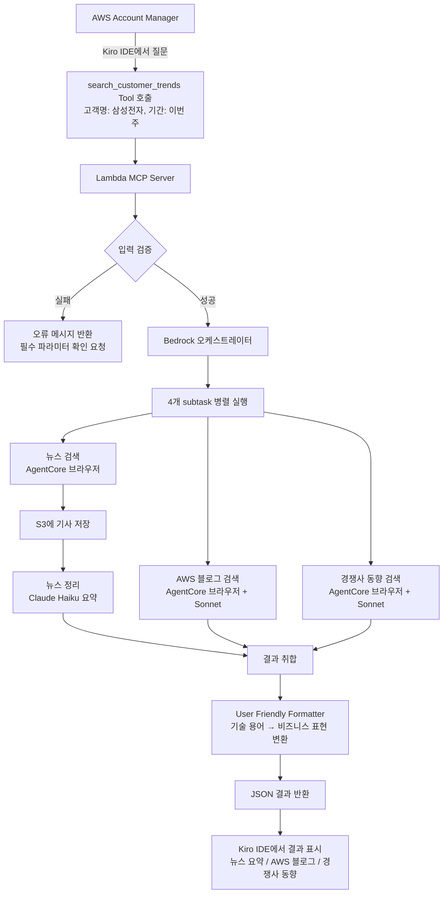
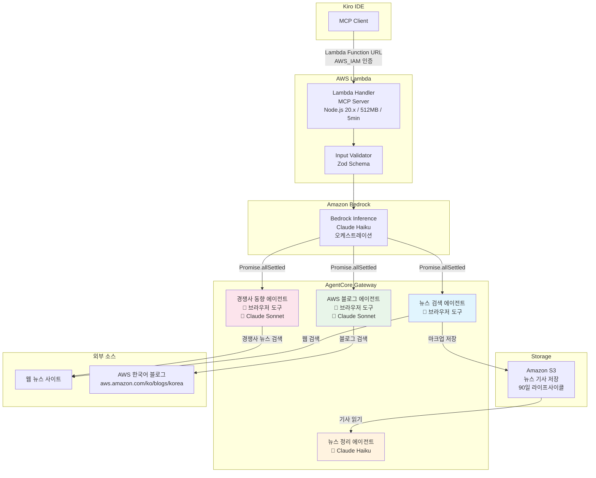

# Customer Trends MCP Server

AWS Account Manager가 담당 고객사의 최신 뉴스, AWS 모범사례 블로그, 경쟁 솔루션 동향을 Kiro IDE에서 한 번의 Tool 호출로 통합 조회할 수 있는 MCP(Model Context Protocol) 서버 애플리케이션입니다.

## 1. 프로젝트 개요

### 목적

고객 미팅 준비 시간을 단축하기 위해, 고객사 관련 뉴스/블로그/경쟁사 동향을 자동으로 수집하고 비즈니스 친화적인 요약으로 제공합니다.

### 구성요소

| 구성요소 | 설명 |
|---------|------|
| Lambda MCP Server | MCP 프로토콜을 구현한 Lambda function. Kiro IDE가 MCP 서버로 등록하여 호출 |
| Bedrock Inference | 사용자 요청을 분석하여 4개 subtask로 분리하는 오케스트레이터 |
| AgentCore Gateway | 브라우저 도구를 제공하여 웹 검색(뉴스, 블로그)을 수행 |
| Claude Haiku | 뉴스 기사 요약 (비용 효율적) |
| Claude Sonnet | AWS 블로그 분석/필터링, 경쟁사 동향 분석 (고품질) |
| Amazon S3 | 검색된 뉴스 기사를 마크업 형식으로 저장 |
| User Friendly Formatter | 기술 용어를 비즈니스 표현으로 변환, JSON 구조로 결과 포맷팅 |
| AWS CDK | Lambda, S3, IAM 등 인프라를 코드로 정의 및 배포 |

### 프로젝트 구조

```
├── src/                          # 애플리케이션 코드
│   ├── handlers/
│   │   ├── lambda.ts             # Lambda 핸들러 (MCP 서버 엔트리포인트)
│   │   ├── tools.ts              # Tool Registry (search_customer_trends)
│   │   ├── resources.ts          # Resource Registry
│   │   └── prompts.ts            # Prompt Registry
│   ├── agents/
│   │   ├── bedrock-client.ts     # Bedrock 오케스트레이터
│   │   ├── news-search.ts        # 뉴스 검색 에이전트 (AgentCore 브라우저)
│   │   ├── news-summary.ts       # 뉴스 정리 에이전트 (Claude Haiku)
│   │   ├── aws-blog.ts           # AWS 블로그 에이전트 (브라우저 + Sonnet)
│   │   └── competitor-news.ts    # 경쟁사 동향 에이전트 (브라우저 + Sonnet)
│   ├── formatters/
│   │   └── user-friendly-formatter.ts  # 결과 포맷터
│   ├── types/                    # TypeScript 타입 정의
│   └── utils/                    # 유틸리티 (JSON-RPC, 입력 검증)
├── infra/                        # CDK 인프라 코드
│   ├── bin/app.ts                # CDK 앱 엔트리포인트
│   └── lib/mcp-infra-stack.ts    # Lambda, S3, IAM 스택 정의
└── .kiro/specs/                  # 스펙 문서 (요구사항, 설계, 태스크)
```


## 2. User Flow



### Tool 호출 예시

Kiro IDE에서 다음과 같이 사용합니다:

```
"삼성전자의 이번 주 트렌드를 검색해 줘"
```

MCP Tool이 호출되면 다음 3개 섹션으로 구분된 JSON 결과가 반환됩니다:
- 고객사 뉴스 요약 (헤드라인 + 50자 요약)
- AWS 모범사례 블로그 (아키텍처/구현 사례만 필터링)
- 경쟁 솔루션 동향 (Azure, GCP 등 경쟁사별 분류)


## 3. 백엔드 아키텍처 (AgentCore 중심)



### 에이전트별 도구/모델 매핑

| 에이전트 | AgentCore 도구 | AI 모델 | 역할 |
|---------|---------------|---------|------|
| 뉴스 검색 | 브라우저 도구 | - | 고객명 기반 웹 뉴스 검색, S3 저장 |
| 뉴스 정리 | - | Claude Haiku | S3 기사 읽기 → 헤드라인/50자 요약 |
| AWS 블로그 | 브라우저 도구 | Claude Sonnet | 블로그 검색 → 모범사례 필터링/요약 |
| 경쟁사 동향 | 브라우저 도구 | Claude Sonnet | 경쟁사 뉴스 검색 → 분류/요약 |

### 오류 처리 전략

- 부분 실패 허용: `Promise.allSettled()`로 일부 에이전트 실패 시에도 성공한 결과 반환
- 오류 섹션에는 사용자 친화적 메시지 표시 (기술적 오류 코드 미노출)
- 모든 오류는 CloudWatch Logs에 기록


## 4. CloudShell에서 CDK 배포하기

### 사전 준비

- AWS 콘솔에 로그인된 상태에서 CloudShell을 실행합니다
- CloudShell은 AWS 자격 증명을 자동으로 사용하므로 별도 설정이 필요 없습니다

### 배포 스텝

```bash
# 1. Git 리포지토리 클론
git clone https://github.com/awskyosej/trendbot.git
cd trendbot

# 2. 애플리케이션 의존성 설치
npm install

# 3. CDK 인프라 디렉토리로 이동 및 의존성 설치
cd infra
npm install

# 4. CDK CLI 설치 (CloudShell에 없는 경우)
npm install -g aws-cdk

# 5. CDK Bootstrap (최초 1회만 실행)
# 현재 계정/리전에 CDK 배포를 위한 기본 리소스를 생성합니다
npx cdk bootstrap

# 6. CloudFormation 템플릿 확인 (선택)
npm run cdk:synth

# 7. 변경사항 미리보기 (선택)
npm run cdk:diff

# 8. 배포
npm run cdk:deploy
```

### 배포 결과 확인

배포가 완료되면 다음과 같은 Output이 표시됩니다:

```
Outputs:
McpInfraStack.McpLambdaFunctionUrl = https://xxxxxxxxxx.lambda-url.us-east-1.on.aws/
```

이 URL이 Kiro IDE에서 MCP 서버로 등록할 Lambda Function URL입니다.

### 배포된 리소스

| 리소스 | 설명 |
|--------|------|
| Lambda Function | Node.js 20.x, 512MB, 5분 타임아웃, esbuild 번들링 |
| S3 Bucket | 뉴스 기사 저장, 90일 자동 삭제, S3 관리형 암호화 |
| IAM Role | Lambda 실행 역할 + Bedrock InvokeModel + AgentCore InvokeAgent + S3 읽기/쓰기 |
| Function URL | AWS_IAM 인증, Kiro IDE MCP 등록용 |

### 스택 삭제

```bash
cd infra
npm run cdk:destroy
```

> 실험 프로젝트이므로 `removalPolicy: DESTROY`와 `autoDeleteObjects: true`가 설정되어 있어, 스택 삭제 시 S3 버킷과 데이터도 함께 삭제됩니다.


## 5. Kiro IDE에서 MCP 서버 설정하기

### Step 1: mcp.json 설정 파일 생성

워크스페이스 루트에 `.kiro/settings/mcp.json` 파일을 생성합니다:

```json
{
  "mcpServers": {
    "customer-trends": {
      "command": "node",
      "args": ["-e", "
        const https = require('https');
        const { sign } = require('@aws-sdk/signature-v4');
        // Lambda Function URL을 통한 MCP 서버 연결
        // 실제 구현 시 AWS SDK를 사용하여 Lambda를 직접 호출
      "],
      "env": {
        "AWS_REGION": "us-east-1",
        "MCP_LAMBDA_URL": "<배포 후 출력된 Lambda Function URL>"
      },
      "disabled": false,
      "autoApprove": ["search_customer_trends"]
    }
  }
}
```

> Lambda Function URL 기반 MCP 서버는 현재 실험적 구성입니다. 실제 연동 방식은 Kiro IDE의 MCP 클라이언트가 Lambda Function URL을 지원하는 방식에 따라 달라질 수 있습니다.

### Step 2: 환경변수 설정

배포 후 출력된 Lambda Function URL을 `MCP_LAMBDA_URL` 환경변수에 설정합니다.

### Step 3: MCP 서버 연결 확인

1. Kiro IDE의 MCP Server 패널에서 `customer-trends` 서버가 표시되는지 확인
2. 서버 상태가 "Connected"인지 확인
3. Tool 목록에 `search_customer_trends`가 표시되는지 확인

### Step 4: Tool 사용

Kiro IDE 채팅에서 다음과 같이 사용합니다:

```
삼성전자의 이번 주 트렌드를 검색해 줘
```

또는 직접 Tool을 호출할 수 있습니다:

```
search_customer_trends 도구를 사용해서 고객명 "LG전자", 기간 "최근 7일"로 검색해 줘
```

### 결과 형식

Tool 호출 결과는 JSON 형태로 반환되며, 3개 섹션으로 구분됩니다:

```json
{
  "sections": [
    { "type": "news", "title": "고객사 뉴스 요약", "status": "success", "items": [...] },
    { "type": "blog", "title": "AWS 모범사례 블로그", "status": "success", "items": [...] },
    { "type": "competitor", "title": "경쟁 솔루션 동향", "status": "success", "items": [...] }
  ],
  "metadata": {
    "customerName": "삼성전자",
    "searchPeriod": "이번 주",
    "generatedAt": "2026-03-30T09:00:00Z",
    "includeCompetitors": true
  }
}
```

Kiro IDE가 이 JSON을 받아 마크다운 등 원하는 형식으로 렌더링합니다.
