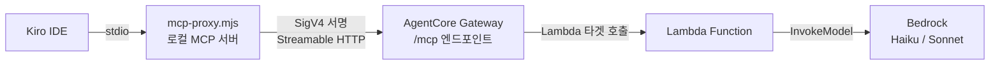
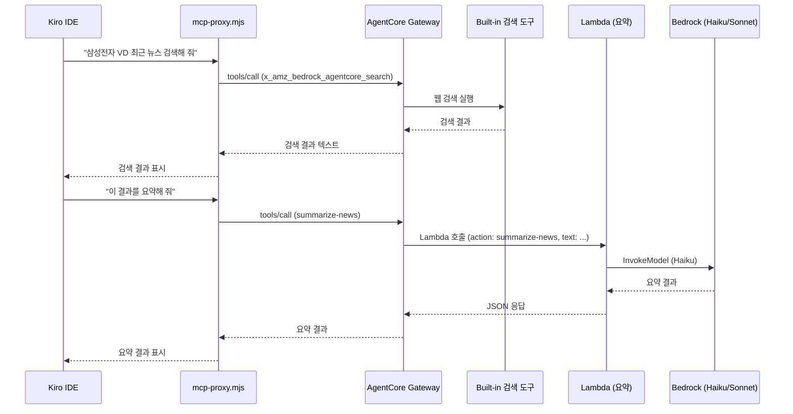
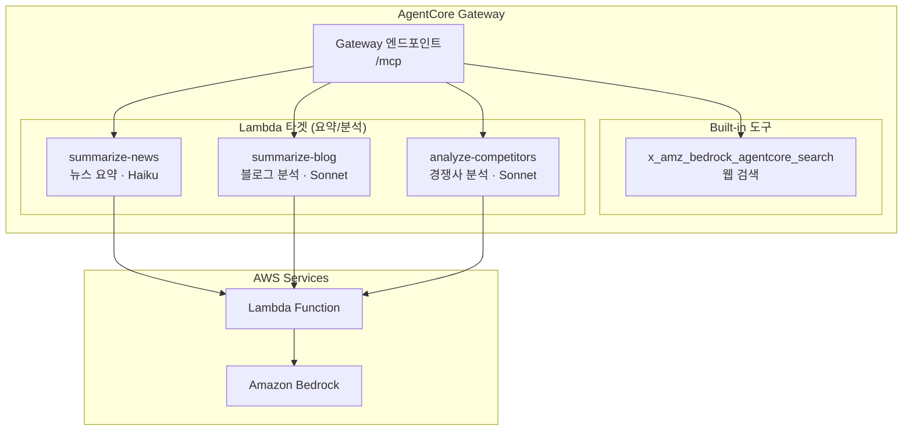

# Customer Trends MCP Server

AWS Account Manager가 담당 고객사의 최신 뉴스, AWS 모범사례 블로그, 경쟁 솔루션 동향을 Kiro IDE에서 조회할 수 있는 MCP(Model Context Protocol) 서버 애플리케이션입니다.

## 1. 프로젝트 개요

### 목적

고객 미팅 준비 시간을 단축하기 위해, 고객사 관련 뉴스/블로그/경쟁사 동향을 자동으로 수집하고 비즈니스 친화적인 요약으로 제공합니다.

### 아키텍처 핵심 포인트

- AgentCore Gateway가 오케스트레이터 역할을 하며, Lambda를 타겟으로 호출합니다 (Lambda가 AgentCore를 호출하는 것이 아님)
- AgentCore Gateway의 built-in 검색 도구와 Lambda 요약 도구가 각각 독립적으로 등록되어 있습니다
- 로컬 MCP 프록시가 Gateway의 도구들을 Kiro IDE에 깔끔한 이름으로 노출합니다
- Kiro IDE의 AI가 상황에 맞게 도구를 선택하여 사용합니다

### 구성요소

| 구성요소 | 역할 |
|---------|------|
| mcp-proxy.mjs | 로컬 MCP 서버. Gateway 도구를 Kiro IDE에 노출하고, SigV4 서명으로 Gateway 호출 |
| AgentCore Gateway | MCP 프로토콜 허브. 등록된 타겟(Lambda, built-in 도구)을 관리하고 호출 |
| Built-in 검색 도구 | AgentCore의 `x_amz_bedrock_agentcore_search`. 웹 검색 수행 |
| Lambda Function | Bedrock 모델(Haiku/Sonnet)을 사용한 텍스트 요약/분석 전용 |
| Amazon S3 | 뉴스 기사 저장 (90일 라이프사이클) |

### Kiro IDE에 노출되는 도구

| 도구 이름 | 실제 Gateway 도구 | 설명 |
|----------|------------------|------|
| `x_amz_bedrock_agentcore_search` | (built-in) | 웹 검색 |
| `summarize-news` | `search-customer-trends___summarize-news` | 뉴스 텍스트 → 헤드라인 + 50자 요약 (Haiku) |
| `summarize-blog` | `search-customer-trends___summarize-blog` | AWS 블로그 → 모범사례 필터링 + 요약 (Sonnet) |
| `analyze-competitors` | `search-customer-trends___analyze-competitors` | 경쟁사 뉴스 → 경쟁사별 분류 + 요약 (Sonnet) |

### 프로젝트 구조

```
├── mcp-proxy.mjs                 # 로컬 MCP 프록시 (SigV4 + 도구 이름 매핑)
├── src/                          # Lambda 코드
│   ├── handlers/
│   │   └── lambda.ts             # Bedrock 요약/분석 전용 핸들러
│   ├── types/                    # TypeScript 타입 정의
│   ├── formatters/               # 결과 포맷터
│   └── utils/                    # 유틸리티
├── infra/                        # CDK 인프라 코드
│   ├── bin/app.ts
│   └── lib/mcp-infra-stack.ts    # Lambda, S3, IAM 스택
├── agentcore-setup-guide.md      # AgentCore Gateway 설정 가이드
└── .kiro/specs/                  # 스펙 문서
```


## 2. 아키텍처

### 전체 흐름



### 핵심: AgentCore Gateway가 Lambda를 호출하는 구조



### AgentCore Gateway 타겟 구성




## 3. 배포 가이드

### 3.1 사전 준비

- AWS 계정 + CLI 자격 증명 설정
- Node.js 20+ 설치
- Bedrock에서 Claude Haiku, Sonnet 모델 접근 활성화

### 3.2 CDK로 Lambda + S3 배포 (CloudShell)

```bash
# Git 클론
git clone https://github.com/awskyosej/trendbot.git
cd trendbot

# 애플리케이션 의존성
npm install

# CDK 배포
cd infra
npm install
npx cdk bootstrap  # 최초 1회
npx cdk deploy --all --require-approval never
```

배포 후 출력되는 Lambda Function URL과 ARN을 메모하세요.

### 3.3 AgentCore Gateway 설정

별도 가이드 참조: [agentcore-setup-guide.md](./agentcore-setup-guide.md)

요약:
1. AgentCore 콘솔에서 Gateway 생성 (IAM 인증)
2. Lambda 타겟 추가 (요약 3개 도구 schema)
3. Gateway URL 확인

### 3.4 배포된 리소스

| 리소스 | 설명 |
|--------|------|
| Lambda Function | Node.js 20.x, 512MB, 5분 타임아웃, Bedrock 요약/분석 전용 |
| S3 Bucket | 뉴스 기사 저장, 90일 자동 삭제 |
| IAM Role | Bedrock InvokeModel + S3 읽기/쓰기 |
| Function URL | AWS_IAM 인증 |
| AgentCore Gateway | MCP 프로토콜 허브, Lambda + built-in 검색 도구 |


## 4. Kiro IDE에서 MCP 서버 설정하기

### Step 1: MCP 프록시 다운로드

```bash
curl -O https://raw.githubusercontent.com/awskyosej/trendbot/main/mcp-proxy.mjs
```

### Step 2: 의존성 설치

```bash
npm install @modelcontextprotocol/sdk zod @smithy/signature-v4 @aws-crypto/sha256-js @aws-sdk/credential-provider-node tslib
```

### Step 3: AWS 자격 증명 확인

SigV4 서명을 위해 로컬 AWS 자격 증명이 필요합니다:
- `~/.aws/credentials` 또는
- `AWS_ACCESS_KEY_ID` / `AWS_SECRET_ACCESS_KEY` 환경변수 또는
- `AWS_PROFILE` 환경변수

해당 IAM 사용자/역할에 `bedrock-agentcore:InvokeGateway` 권한이 필요합니다.

### Step 4: mcp.json 설정

`.kiro/settings/mcp.json`:

```json
{
  "mcpServers": {
    "customer-trends": {
      "command": "node",
      "args": ["${workspaceFolder}/mcp-proxy.mjs"],
      "env": {
        "AWS_REGION": "us-east-1",
        "MCP_GATEWAY_URL": "<AgentCore Gateway MCP URL>"
      },
      "disabled": false,
      "autoApprove": []
    }
  }
}
```

### Step 5: 연결 확인

MCP Server 패널에서 4개 도구가 표시되면 성공:
- `x_amz_bedrock_agentcore_search`
- `summarize-news`
- `summarize-blog`
- `analyze-competitors`

### Step 6: 사용 예시

```
삼성전자 VD의 최근 7일 뉴스를 검색해 줘
```

```
이 검색 결과를 요약해 줘
```

```
AWS 블로그에서 최근 모범사례를 찾아줘
```

Kiro AI가 상황에 맞는 도구를 자동으로 선택하여 실행합니다.
